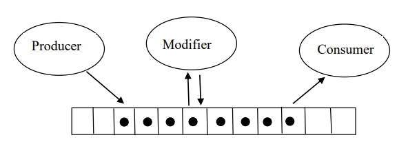

# Concurrent-Programming

## The goal of this project is to acquire familiarity using POSIX thread management primitives and Linux processes synchronization.
- Understand and use LINUX functions for creating and synchronize shared memory between LINUX processes.
- Understand to write POSIX thread programs, where threads execute in different processes and communicate through shared memory (shmget, shmat, shmdt, shmctl)

## Problem Demonstration
- In this project we provide 2 parts of solution to the producer-modifier-consumer problem. A producer produces items in form of a stream and loads then into a buffer. A modifier receives each item, modifies it and sends it to the consumer who in turn, prints the final result in an output file. The solution containes 2 parts.

| Producer-Modifier-Consumer |
| --- |
|  |

## Part 1 - Single Process - Multiple POSIX Threads
- Code for part 1 is located at `part1`
- Compile: `make`
- Execute `./procucer <bufer.size> <total.items (default=1000)>`

## Part 2 - Multiple Processes - Shared Memory Segment
- Code for part 2 is located at `part2`
- Compile: `make`
- Execute `./procucer <bufer.size> <total.items (default=1000)>`

## Contact
- apost035@umn, trs.apostolou@gmail.com
